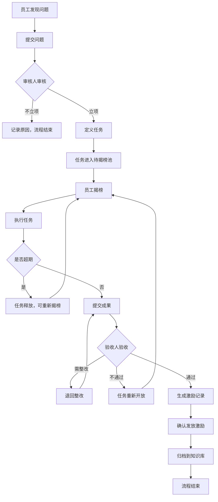
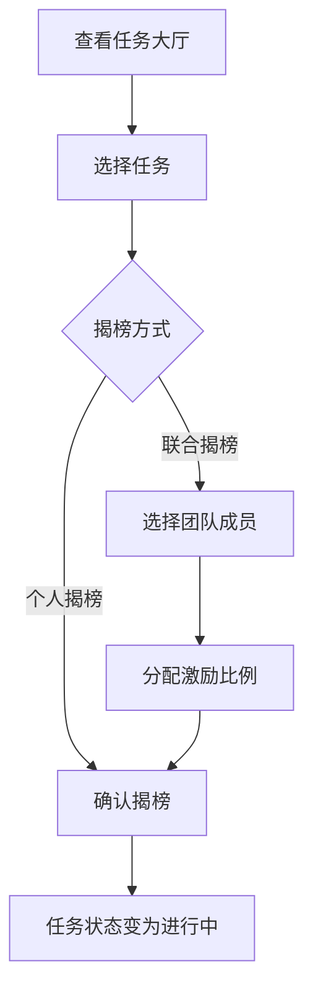

# 揭榜挂帅任务管理系统 - 软件需求规格说明书

**版本**: V1.0  
**日期**: 2026-02-09  
**状态**: 草稿

---

## 1. 文档概述

### 1.1 项目背景

为支撑公司"揭榜挂帅任务管理制度"的落地执行，需开发一套任务管理系统，实现问题提交、任务立项、揭榜执行、验收激励的全流程在线化管理。

### 1.2 系统目标

- 支持问题的提交与审核立项
- 支持任务的公开揭榜与多人协作
- 支持验收与激励发放管理
- 支持知识沉淀与复用
- 提供数据统计看板

---

## 2. 用户角色与权限

### 2.1 角色定义

| 角色 | 说明 | 主要权限 |
|------|------|---------|
| **系统管理员** | 系统维护与配置人员 | 用户管理、角色分配、系统配置 |
| **问题审核人** | 负责问题立项与任务定义 | 问题审核、任务定义、激励设置 |
| **验收人** | 负责任务验收 | 验收确认、结果评定 |
| **普通员工** | 可提交问题并揭榜 | 问题提交、任务揭榜、成果提交 |

> **说明**: 审核人与验收人为动态指定，由管理员授权，一个用户可同时拥有多个角色。

### 2.2 权限矩阵

| 功能模块 | 系统管理员 | 问题审核人 | 验收人 | 普通员工 |
|---------|-----------|-----------|--------|---------|
| 用户管理 | ✅ | ❌ | ❌ | ❌ |
| 角色分配 | ✅ | ❌ | ❌ | ❌ |
| 系统配置 | ✅ | ❌ | ❌ | ❌ |
| 问题提交 | ✅ | ✅ | ✅ | ✅ |
| 问题审核/立项 | ✅ | ✅ | ❌ | ❌ |
| 任务定义 | ✅ | ✅ | ❌ | ❌ |
| 任务揭榜 | ✅ | ✅ | ✅ | ✅ |
| 成果提交 | ✅ | ✅ | ✅ | ✅ |
| 任务验收 | ✅ | ❌ | ✅ | ❌ |
| 激励发放确认 | ✅ | ✅ | ❌ | ❌ |
| 知识库管理 | ✅ | ✅ | ❌ | ❌ |
| 知识库查看 | ✅ | ✅ | ✅ | ✅ |
| 数据看板 | ✅ | ✅ | ✅ | ✅ |

---

## 3. 功能需求

### 3.1 用户管理模块

#### 3.1.1 飞书集成

- **FR-U-001**: 支持通过飞书OAuth登录系统
- **FR-U-002**: 首次登录时自动创建用户账号，同步飞书基本信息
- **FR-U-003**: 支持从飞书通讯录同步部门和人员信息
- **FR-U-004**: 部门信息定期自动同步（可配置同步频率）
- **FR-U-005**: 支持手动触发部门/人员同步

#### 3.1.2 用户信息管理

- **FR-U-006**: 用户信息包含：飞书用户ID、工号、姓名、部门、邮箱、头像、状态（启用/禁用）
- **FR-U-007**: 系统管理员可编辑用户状态（启用/禁用）
- **FR-U-008**: 支持查看用户详情

#### 3.1.3 角色管理

- **FR-U-009**: 系统管理员可为用户分配/取消角色
- **FR-U-010**: 一个用户可拥有多个角色
- **FR-U-011**: 角色变更即时生效

---

### 3.2 问题提交模块

#### 3.2.1 问题创建

- **FR-P-001**: 所有用户可提交问题
- **FR-P-002**: 问题必填字段：
  - 问题标题（不超过50字）
  - 所属场景（研发/运维/交付/支持/其他）
  - 问题背景描述
  - 问题出现频率（每日/每周/每月/季度/偶发）
  - 影响范围（个人/团队/部门/公司）
  - 问题描述（具体痛点）
  - 价值假设（至少选择一项）：
    - [ ] 可减少人力/时间投入
    - [ ] 可减少成本/返工
    - [ ] 可改善稳定性/质量
  - 价值假设说明（文字描述）
- **FR-P-003**: 问题可选字段：
  - 现有处理方式
  - 附件（支持图片、文档）
- **FR-P-004**: 问题提交后状态为"待审核"

#### 3.2.2 问题查询

- **FR-P-005**: 用户可查看自己提交的所有问题
- **FR-P-006**: 支持按状态、场景、提交时间筛选
- **FR-P-007**: 问题状态包含：待审核、已立项、不立项、已归档

---

### 3.3 问题审核与立项模块

#### 3.3.1 问题审核

- **FR-R-001**: 审核人可查看所有待审核问题
- **FR-R-002**: 审核人对问题做出审核决定：
  - **不立项**: 需填写不立项原因
  - **立项**: 进入任务定义流程
- **FR-R-003**: 支持将重复问题合并（标记关联）

#### 3.3.2 任务定义（立项时）

立项时须定义以下内容：

- **FR-R-004**: 任务基础信息
  - 任务标题
  - 任务目标与背景
  - 任务范围（做什么/不做什么）
  - 完成时限（日期）
  
- **FR-R-005**: 任务等级与激励
  - 任务等级（S/A/B/C）
  - 激励总额（根据等级范围填写）
  - 问题提出人激励比例（20%-30%）
  - 揭榜完成人激励比例（自动计算）

| 等级 | 激励范围 | 说明 |
|------|---------|------|
| S | 8000-15000元 | 核心流程或关键降本 |
| A | 3000-8000元 | 明确提效或稳定性改进 |
| B | 1000-3000元 | 工具化/自动化优化 |
| C | 200-1000元 | 小型优化/问题修复 |

- **FR-R-006**: 验收标准
  - 支持添加多条验收标准
  - 每条标准包含：描述、类型（量化/行为可验证）
  
- **FR-R-007**: 指定验收人（从有验收人角色的用户中选择）

- **FR-R-008**: 非现金激励设置
  - 积分值（可选）
  - 徽章类型（可选，如：效率之星、降本达人等）

- **FR-R-009**: 立项完成后，任务进入"待揭榜"状态

---

### 3.4 任务揭榜模块

#### 3.4.1 任务列表

- **FR-T-001**: 所有用户可查看待揭榜任务列表
- **FR-T-002**: 任务列表展示：任务标题、等级、激励金额、截止日期、当前揭榜数
- **FR-T-003**: 支持按等级、场景、激励范围筛选
- **FR-T-004**: 点击任务可查看详情

#### 3.4.2 揭榜操作

- **FR-T-005**: 用户可对待揭榜任务进行揭榜
- **FR-T-006**: 揭榜方式：
  - **个人揭榜**: 单人承接
  - **联合揭榜**: 多人协作，需指定主负责人
- **FR-T-007**: 联合揭榜时，主负责人需填写：
  - 团队成员（从系统用户中选择）
  - 各成员激励分配比例（总计100%）
- **FR-T-008**: 同一任务允许多人/多组同时揭榜（竞争机制）
- **FR-T-009**: 揭榜后任务状态变为"进行中"
- **FR-T-010**: 揭榜人可主动放弃任务（任务重新开放揭榜）

#### 3.4.3 任务超期处理

- **FR-T-011**: 系统每日检查任务截止日期
- **FR-T-012**: 超期未提交成果的任务自动释放：
  - 原揭榜记录状态标记为"超期"
  - 任务重新变为"待揭榜"状态
  - 其他人可重新揭榜
- **FR-T-013**: 记录用户超期次数，供后续揭榜审批参考

---

### 3.5 成果提交与验收模块

#### 3.5.1 成果提交

- **FR-V-001**: 揭榜人可提交任务成果
- **FR-V-002**: 成果提交内容：
  - 成果说明（文字描述）
  - 完成证据（附件，支持文档、截图、视频）
  - 验收标准达成情况（逐条说明）
- **FR-V-003**: 联合揭榜时由主负责人提交成果
- **FR-V-004**: 成果提交后任务状态变为"待验收"

#### 3.5.2 任务验收

- **FR-V-005**: 验收人可查看待验收任务列表
- **FR-V-006**: 验收人对成果进行评审，结果为：
  - **通过**: 任务完成，进入激励发放流程
  - **需整改**: 填写整改意见，任务退回揭榜人
  - **不通过**: 填写原因，任务重新开放揭榜
- **FR-V-007**: 整改后揭榜人可重新提交成果
- **FR-V-008**: 验收通过后任务状态变为"已完成"

---

### 3.6 激励管理模块

#### 3.6.1 激励发放

- **FR-I-001**: 任务验收通过后，系统自动生成激励记录
- **FR-I-002**: 激励记录包含：
  - 任务信息
  - 问题提出人及其激励金额
  - 揭榜完成人（含团队成员）及各自激励金额
  - 积分与徽章（如有）
- **FR-I-003**: 审核人确认激励发放
- **FR-I-004**: 激励确认后状态变为"已发放"

#### 3.6.2 激励查询

- **FR-I-005**: 用户可查看自己的激励记录
- **FR-I-006**: 激励记录包含：任务名称、角色（提出人/完成人）、金额、积分、徽章、发放状态

#### 3.6.3 积分与徽章

- **FR-I-007**: 系统记录用户累计积分（仅展示，无兑换机制）
- **FR-I-008**: 系统记录用户获得的徽章列表
- **FR-I-009**: 用户可在个人中心查看积分与徽章
- **FR-I-010**: 系统预设徽章类型：

| 徽章名称 | 获得条件 | 图标建议 |
|---------|---------|----------|
| 效率之星 | 完成提效类任务 | ⚡ |
| 降本达人 | 完成降本类任务 | 💰 |
| 质量卫士 | 完成质量改进类任务 | 🛡️ |
| 首揭勇士 | 首次揭榜并完成 | 🎯 |
| 问题猎手 | 提交问题被立项5次以上 | 🔍 |
| 揭榜达人 | 完成任务10次以上 | 🏆 |
| 协作之星 | 参与联合揭榜5次以上 | 🤝 |
| S级精英 | 完成S级任务 | 👑 |

---

### 3.7 知识库模块

#### 3.7.1 自动归档

- **FR-K-001**: 任务验收通过后，自动归档到知识库
- **FR-K-002**: 归档内容包含：
  - 问题信息（背景、描述、价值）
  - 解决方案（任务目标、验收标准、成果说明）
  - 完成证据（附件）
  - 执行人与验收人信息

#### 3.7.2 知识查询

- **FR-K-003**: 所有用户可浏览知识库
- **FR-K-004**: 支持按场景、等级、关键词搜索
- **FR-K-005**: 支持查看知识详情

#### 3.7.3 知识管理

- **FR-K-006**: 审核人可编辑知识条目（补充标签、优化描述）
- **FR-K-007**: 支持将优秀案例标记为"推荐"

---

### 3.8 数据看板模块

#### 3.8.1 总览看板

- **FR-D-001**: 任务总量统计
  - 问题提交数、立项数、完成数
  - 各状态任务数量分布
- **FR-D-002**: 激励统计
  - 已发放总金额
  - 各等级任务激励分布
- **FR-D-003**: 完成率统计
  - 任务完成率（完成数/立项数）
  - 超期率（超期数/揭榜数）

#### 3.8.2 排行榜

- **FR-D-004**: 个人揭榜排行榜（按完成任务数）
- **FR-D-005**: 个人激励排行榜（按获得激励金额）
- **FR-D-006**: 问题贡献排行榜（按立项问题数）
- **FR-D-007**: 积分排行榜
- **FR-D-008**: 支持按时间范围筛选（本月/本季度/本年/全部）

#### 3.8.3 任务分布

- **FR-D-009**: 按场景分布饼图
- **FR-D-010**: 按等级分布柱状图
- **FR-D-011**: 按部门分布统计

#### 3.8.4 趋势分析

- **FR-D-012**: 任务提交趋势（按月/周）
- **FR-D-013**: 任务完成趋势
- **FR-D-014**: 激励发放趋势

#### 3.8.5 数据导出

- **FR-D-015**: 看板数据支持导出为Excel格式
- **FR-D-016**: 激励记录支持导出为Excel格式
- **FR-D-017**: 任务列表支持导出为Excel格式
- **FR-D-018**: 知识库支持导出为Excel/PDF格式

---

## 4. 非功能需求

### 4.1 性能需求

- **NFR-P-001**: 页面响应时间 ≤ 2秒
- **NFR-P-002**: 支持 100 并发用户

### 4.2 安全需求

- **NFR-S-001**: 用户密码加密存储
- **NFR-S-002**: 操作日志记录（关键操作）
- **NFR-S-003**: 基于角色的访问控制

### 4.3 可用性需求

- **NFR-A-001**: 系统可用性 ≥ 99%
- **NFR-A-002**: 关键数据定期备份

### 4.4 兼容性需求

- **NFR-C-001**: 支持主流浏览器（Chrome、Edge、Firefox）
- **NFR-C-002**: 暂不考虑移动端支持

---

## 5. 数据模型（概要）

### 5.1 核心实体

```
用户 (User)
├── 用户ID、工号、姓名、部门、邮箱、密码、状态
└── 角色列表

问题 (Problem)
├── 问题ID、标题、场景、背景、频率、影响范围
├── 问题描述、价值假设、附件
├── 提交人、提交时间、状态
└── 不立项原因（如有）

任务 (Task)
├── 任务ID、关联问题ID、标题、目标、范围
├── 等级、激励总额、提出人比例
├── 完成时限、验收人
├── 积分值、徽章类型
├── 验收标准列表
└── 状态、创建时间

揭榜记录 (Claim)
├── 揭榜ID、任务ID、主负责人、揭榜时间
├── 是否联合揭榜、团队成员及比例
└── 状态（进行中/已完成/超期/已放弃）

成果 (Deliverable)
├── 成果ID、揭榜ID、成果说明
├── 验收标准达成情况、附件列表
└── 提交时间、状态

验收记录 (Acceptance)
├── 验收ID、成果ID、验收人
├── 验收结果、整改意见/不通过原因
└── 验收时间

激励记录 (Reward)
├── 激励ID、任务ID、用户ID
├── 角色类型、金额、积分、徽章
└── 发放状态、确认时间

知识条目 (Knowledge)
├── 知识ID、关联任务ID
├── 问题摘要、解决方案摘要
├── 标签、是否推荐
└── 归档时间
```

---

## 6. 页面原型（概要）

| 页面 | 主要功能 |
|------|---------|
| 登录页 | 用户登录 |
| 首页/工作台 | 待办事项、快捷入口、个人统计 |
| 问题提交页 | 填写问题信息并提交 |
| 我的问题页 | 查看个人提交的问题列表 |
| 问题审核页 | 审核人查看待审核问题、进行审核操作 |
| 任务定义页 | 审核人定义任务详情（立项时） |
| 任务大厅页 | 查看所有待揭榜任务、进行揭榜 |
| 我的任务页 | 查看个人揭榜的任务、提交成果 |
| 待验收任务页 | 验收人查看待验收任务、进行验收 |
| 激励管理页 | 查看激励记录、确认发放 |
| 知识库页 | 浏览、搜索知识条目 |
| 数据看板页 | 数据统计与可视化 |
| 用户管理页 | 管理员管理用户与角色 |
| 系统配置页 | 管理员进行系统配置 |
| 个人中心页 | 个人信息、积分徽章、激励记录 |

---

## 7. 流程图

### 7.1 主流程



### 7.2 揭榜流程



---

## 8. 已确认事项

| 事项 | 确认结果 |
|-----|----------|
| 积分兑换规则 | 积分仅作为统计展示，无兑换机制 |
| 徽章类型 | 系统预设8种徽章（见3.6.3节），暂不支持自定义 |
| 部门数据 | 对接飞书通讯录，自动同步 |
| 登录方式 | 对接飞书OAuth登录 |
| 数据导出 | 需要，支持Excel/PDF格式导出 |

---

## 9. 版本记录

| 版本 | 日期 | 修改内容 | 作者 |
|------|------|---------|------|
| V1.0 | 2026-02-09 | 初稿 | - |
| V1.1 | 2026-02-09 | 确认飞书集成、徽章类型、数据导出等需求 | - |

---

*文档结束*
